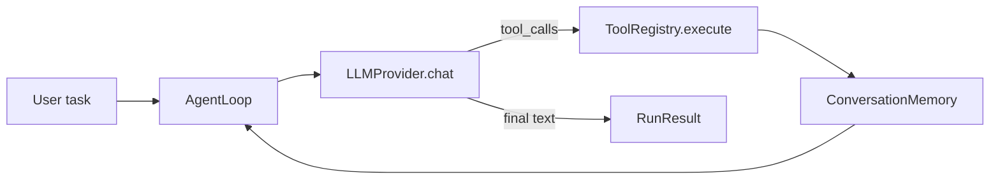

# agentloop

A small, reusable **Python agentic framework** for building LLM agents with tools, memory, and an observe–act loop. Other developers can extend it by registering tools, swapping LLM providers, and hooking lifecycle events—without pulling in a heavy dependency stack.

## Features

- **Agent loop** — model → tool calls → tool results → repeat until done or `max_iterations`
- **Tool registry** — decorate functions; JSON schema inferred from type hints
- **Pluggable LLM providers** — OpenAI-compatible API built-in; implement one method for custom backends
- **Memory** — conversation history with optional system prompt
- **Events** — `on_tool_call`, `on_iteration`, `on_run_end`, generic `subscribe()` hooks
- **Mock provider** — run examples and tests without an API key

## Install

**From PyPI** (after you publish — see [PUBLISHING.md](PUBLISHING.md)):

```bash
pip install agentloop-framework
pip install "agentloop-framework[openai]"   # OpenAI-compatible provider
```

**From source** (development):

```bash
cd agentloop
pip install -e .

# For OpenAI / Azure / Ollama (OpenAI-compatible HTTP API):
pip install -e ".[openai]"

# Development:
pip install -e ".[dev]"
```

> The PyPI name is `agentloop-framework` because `agentloop` is already taken. Imports remain `from agentloop import ...`.

## Quick start (no API key)

```python
import asyncio
from agentloop import Agent
from agentloop.providers import MockProvider
from agentloop.tools import ToolRegistry

tools = ToolRegistry()

@tools.register(description="Echo text back.")
def echo(text: str) -> str:
    return text

agent = Agent.create(
    provider=MockProvider(MockProvider.tool_then_answer("echo", {"text": "hi"}, final="Done.")),
    system="You are helpful.",
    tools=tools,
)

asyncio.run(agent.run("Say hi"))
```

Run the bundled example:

```bash
python examples/basic_mock.py
```

## Example agents

### Chatbot (multi-turn)

Interactive CLI chat with persistent memory and tools (time, calculator):

```bash
python examples/chatbot.py --mock          # offline, no API key
python examples/chatbot.py --live          # needs OPENAI_API_KEY
```

### Voice agent

Speak to the agent and hear replies (or use `--text` to type):

```bash
python examples/voice_agent.py --text --mock   # easiest start
pip install -e ".[voice]"
python examples/voice_agent.py --mock          # microphone + speaker
```

See [examples/README.md](examples/README.md) for full details.

### Cloud Run + Pinecone RAG + React UI

Production-style deployment with vector search:

```bash
# See deploy/cloud-run/README.md for full steps
docker build -f deploy/cloud-run/Dockerfile -t agentloop-chat .
```

Stack: **React chat UI** → **FastAPI `/api/chat`** → **agentloop** → **Pinecone** on **Google Cloud Run**.

## Live LLM (OpenAI-compatible)

```python
import asyncio
from agentloop import Agent
from agentloop.providers import OpenAICompatibleProvider
from agentloop.tools import ToolRegistry

tools = ToolRegistry()

@tools.register(description="Add two integers.")
def add(a: int, b: int) -> int:
    return a + b

agent = Agent.create(
    provider=OpenAICompatibleProvider(model="gpt-4o-mini"),
    system="Use tools when math is needed.",
    tools=tools,
)

asyncio.run(agent.run("What is 12 + 30?"))
```

Environment variables:

| Variable | Purpose |
|----------|---------|
| `OPENAI_API_KEY` | API key |
| `OPENAI_BASE_URL` | Base URL (default `https://api.openai.com/v1`; use for Ollama, Azure, vLLM) |
| `OPENAI_MODEL` | Model id (example script only) |

## Architecture



### Extension points

| Piece | How to extend |
|-------|----------------|
| **LLM** | Class with `async def chat(messages, tools) -> LLMResponse` — see `examples/custom_provider.py` |
| **Tools** | `@registry.register` or `registry.add(name, handler, ...)` |
| **Memory** | Pass `ConversationMemory(system_prompt=...)` into `AgentLoop` |
| **Observability** | `AgentEvents(on_tool_call=..., subscribe=lambda e, p: ...)` |
| **Low-level control** | Use `AgentLoop` directly instead of `Agent` |

## Project layout

```
agentloop/
  agent.py          # Agent.create() builder
  loop.py           # Core observe–act loop
  tools.py          # ToolRegistry
  memory.py         # ConversationMemory
  events.py         # AgentEvents
  types.py          # Message, ToolCall, RunResult, ...
  providers/
    base.py         # LLMProvider protocol
    openai_compatible.py
    mock.py
examples/
  chatbot.py        # Multi-turn interactive chat
  voice_agent.py    # Speech input / spoken output
  helpers.py        # Shared tools + agent factory
  README.md
tests/
```

## Tests

```bash
pytest
```

## Design choices

- **Minimal core** — zero required runtime dependencies; `httpx` only for the optional OpenAI provider.
- **Async-first** — `asyncio` throughout; sync wrappers can wrap `asyncio.run` in your app.
- **Provider-agnostic** — not tied to Cursor or any single vendor; bring your own model endpoint.

## License

MIT
