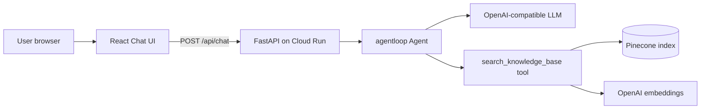

# Cloud Run deployment — Pinecone RAG chatbot

**Yes — any agentloop chatbot can be deployed to Google Cloud Run.**  
Cloud Run runs your Docker container as a stateless HTTP service. This folder is a complete reference stack:

```
React chat UI  →  POST /api/chat  →  agentloop agent  →  Pinecone (RAG tool)
     ↑                                      ↓
  same Cloud Run URL (UI + API in one container)
```

## Architecture



| Component | Role |
|-----------|------|
| **React UI** (`ui/`) | Chat bubbles, session id in `localStorage`, calls REST API |
| **FastAPI** (`api/main.py`) | `/api/chat`, `/api/session`, `/health` |
| **agentloop** | Multi-turn agent with tool loop |
| **Pinecone** | Vector store for document retrieval (RAG) |
| **Cloud Run** | Hosts the Docker image, HTTPS URL, auto-scaling |

## API endpoints (for React or any client)

| Method | Path | Body | Response |
|--------|------|------|----------|
| `GET` | `/health` | — | `{ status, rag_live, ... }` |
| `POST` | `/api/session` | — | `{ session_id }` |
| `POST` | `/api/chat` | `{ message, session_id? }` | `{ session_id, answer, rag_enabled, iterations }` |
| `DELETE` | `/api/session/{id}` | — | `{ ok: true }` |

The React app in `ui/src/api.js` already uses these endpoints.

## Prerequisites

1. [Google Cloud](https://cloud.google.com) project with billing enabled
2. [gcloud CLI](https://cloud.google.com/sdk/docs/install) installed and logged in
3. [OpenAI API key](https://platform.openai.com) (chat + embeddings)
4. [Pinecone](https://www.pinecone.io) account + index

### Create Pinecone index

- **Name:** `agentloop-kb` (or set `PINECONE_INDEX`)
- **Dimensions:** `1536` (for `text-embedding-3-small`)
- **Metric:** cosine

Load sample documents:

```powershell
cd "c:\Agentic AI\agentloop"
pip install -r deploy/cloud-run/requirements.txt
pip install -e .

$env:OPENAI_API_KEY = "sk-..."
$env:PINECONE_API_KEY = "..."
$env:PINECONE_INDEX = "agentloop-kb"
python deploy/cloud-run/scripts/ingest.py
```

Without Pinecone keys, the API still runs using a **mock knowledge base** (for local testing only).

---

## Local development

### 1. API only

```powershell
cd "c:\Agentic AI\agentloop"
pip install -r deploy/cloud-run/requirements.txt
pip install -e .

$env:PYTHONPATH = "c:\Agentic AI\agentloop"
$env:OPENAI_API_KEY = "sk-..."
# optional Pinecone keys

uvicorn api.main:app --app-dir deploy/cloud-run --host 0.0.0.0 --port 8080
```

Test: `curl http://localhost:8080/health`

### 2. React UI (dev server with proxy)

```powershell
cd deploy/cloud-run/ui
npm install
npm run dev
```

Open http://localhost:5173 — Vite proxies `/api` to `:8080`.

### 3. Production-like (single container locally)

```powershell
cd "c:\Agentic AI\agentloop"
docker build -f deploy/cloud-run/Dockerfile -t agentloop-chat .
docker run -p 8080:8080 --env-file deploy/cloud-run/.env agentloop-chat
```

Open http://localhost:8080

---

## Deploy to Google Cloud Run

Run from the **repo root**. Replace `PROJECT_ID` and region as needed.

```powershell
$PROJECT_ID = "your-gcp-project"
$REGION = "us-central1"
$SERVICE = "agentloop-chat"

gcloud config set project $PROJECT_ID
gcloud services enable run.googleapis.com artifactregistry.googleapis.com cloudbuild.googleapis.com

# Build and push image (Cloud Build)
gcloud builds submit --tag "gcr.io/$PROJECT_ID/$SERVICE" -f deploy/cloud-run/Dockerfile .

# Deploy (set secrets via env vars — prefer Secret Manager in production)
gcloud run deploy $SERVICE `
  --image "gcr.io/$PROJECT_ID/$SERVICE" `
  --region $REGION `
  --platform managed `
  --allow-unauthenticated `
  --port 8080 `
  --memory 512Mi `
  --min-instances 0 `
  --set-env-vars "OPENAI_MODEL=gpt-4o-mini,EMBEDDING_MODEL=text-embedding-3-small,PINECONE_INDEX=agentloop-kb" `
  --set-secrets "OPENAI_API_KEY=openai-api-key:latest,PINECONE_API_KEY=pinecone-api-key:latest"
```

> **Secrets:** Create secrets first in Secret Manager, or use `--set-env-vars OPENAI_API_KEY=sk-...` for a quick test (not recommended for production).

After deploy, Cloud Run prints a URL like:

`https://agentloop-chat-xxxxx-uc.a.run.app`

That URL serves **both** the React chat UI (`/`) and the API (`/api/chat`).

### Connect React UI when hosted separately

If you deploy the UI to Vercel/Netlify and API to Cloud Run, build with:

```bash
VITE_API_URL=https://agentloop-chat-xxxxx-uc.a.run.app npm run build
```

---

## Cloud Run notes

| Topic | Guidance |
|-------|----------|
| **Stateless containers** | Sessions are in-memory per instance. For production scaling, use Redis/Firestore or send full history from the client. |
| **Cold starts** | First request after idle may be slow; set `--min-instances 1` if needed. |
| **Timeouts** | LLM + Pinecone can take 10–30s; Cloud Run default timeout is 300s (OK). |
| **CORS** | Set `CORS_ORIGINS=https://your-ui.com` if UI and API are on different domains. |
| **Cost** | Pay per request + CPU/memory while handling requests; Pinecone and OpenAI billed separately. |

---

## File layout

```
deploy/cloud-run/
  Dockerfile
  requirements.txt
  .env.example
  api/
    main.py           # FastAPI + static UI
    agent_factory.py  # agentloop + RAG tool
    rag.py            # Pinecone + embeddings
    sessions.py       # chat session store
  ui/                 # React chat app
  scripts/ingest.py   # load docs into Pinecone
```

---

## FAQ

**Can I deploy only the API and use my own React app?**  
Yes. Call `POST /api/chat` from any frontend. See `ui/src/api.js` for the contract.

**Can I use Azure OpenAI or Ollama?**  
Yes. Set `OPENAI_BASE_URL` and `OPENAI_MODEL` to your OpenAI-compatible endpoint.

**Is Pinecone required?**  
For production RAG, yes. For local demos, the mock KB works without Pinecone keys.
